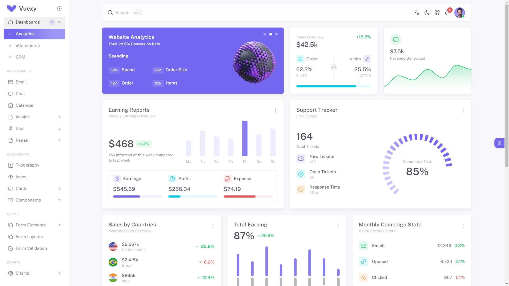
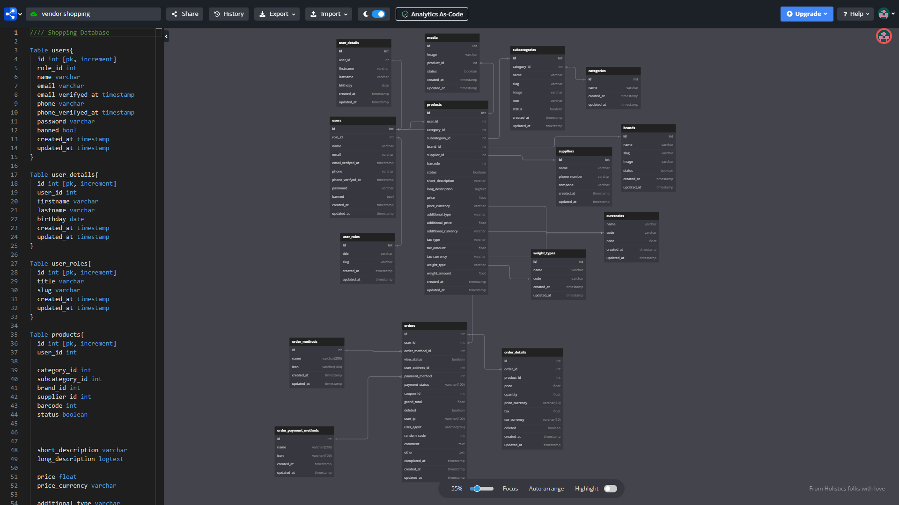
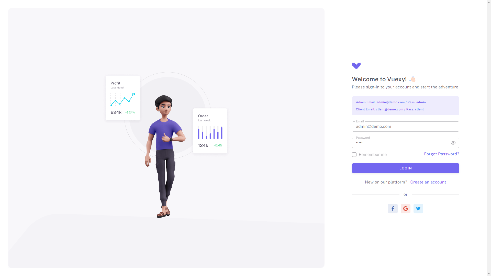
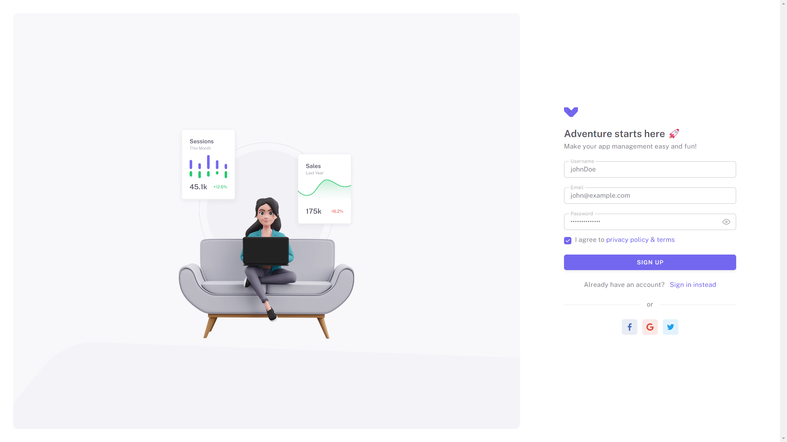
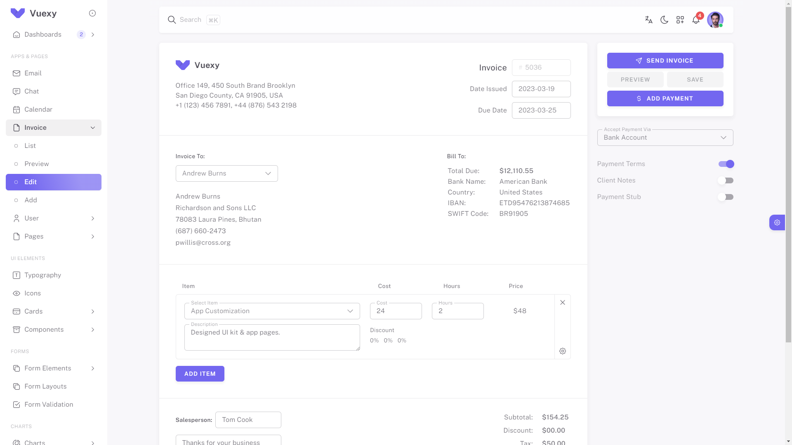
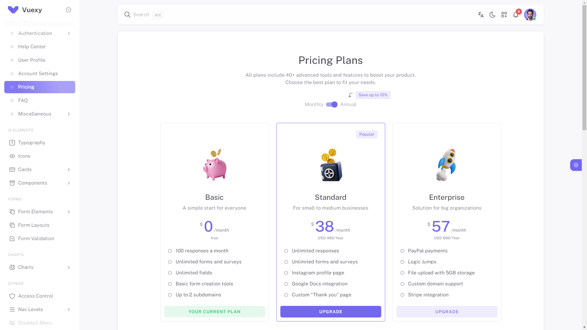

# PBL Vendor Project



## About Porject
> Some information ...

## Requirements
- PHP ^8.0.2
- Composer 2
- Laravel v10
- npm v9.6.0
- node v18.1.0

## Laravel required PHP Extensions
- OpenSSL PHP Extension
- PDO PHP Extension
- Mbstring PHP Extension
- Tokenizer PHP Extension
- XML PHP Extension

## Install guide

```shell
composer install
```

```shell
npm install
```

```shell
php artisan key:generate
```

```shell
php artisan storage:link
```

Set .env database variables
```dotenv
DB_CONNECTION=mysql
DB_HOST=127.0.0.1
DB_PORT=3306
DB_DATABASE=pbl-vendor-laravel
DB_USERNAME=root
DB_PASSWORD=
```

```shell
php artisan optimize:clear
```

```shell
php artisan migrate:fresh --seed
```

Run Laravel server
```shell
php artisan serve
```

Run Vite server (Frontend)
```shell
npm run dev
```

## Database Diagram:

- https://dbdiagram.io/d/63f70bb7296d97641d831ebd

## Screenshots







## Used articles
- https://www.binaryboxtuts.com/php-tutorials/generating-pdf-from-html-in-laravel-8/
- https://bagisto.com/en/how-to-generate-a-pdf-in-laravel-view/
- https://github.com/barryvdh/laravel-dompdf

## Support
> If there are any problems, please leave a issue
>
[ > Click on the link to write a issue](https://github.com/KIUT-Projects/pbl-vendor-laravel/issues)

## Authors
- ISE-51U - Umarov Kamoliddin ([@UzSoftic](https://github.com/uzsoftic))
- ISE-51U - Abdukhamidov Abdurakhmon ([@AbdurakhmonAbdukhamidov](https://github.com/AbdurakhmonAbdukhamidov))
- ISE-51U - Zokirov Hojiakbar ([@Khojiakbar07](https://github.com/Khojiakbar07))
- ISE-51U - Rajabboyev Inoyatulla ([@uz-developer](https://github.com/uz-developer))

## Versions
- v0.1 - Pre release
- ...

## Additional

This template should help get you started developing with Vue 3 in Vite.

## Recommended IDE Setup

[VSCode](https://code.visualstudio.com/) + [Volar](https://marketplace.visualstudio.com/items?itemName=johnsoncodehk.volar) (and disable Vetur).
